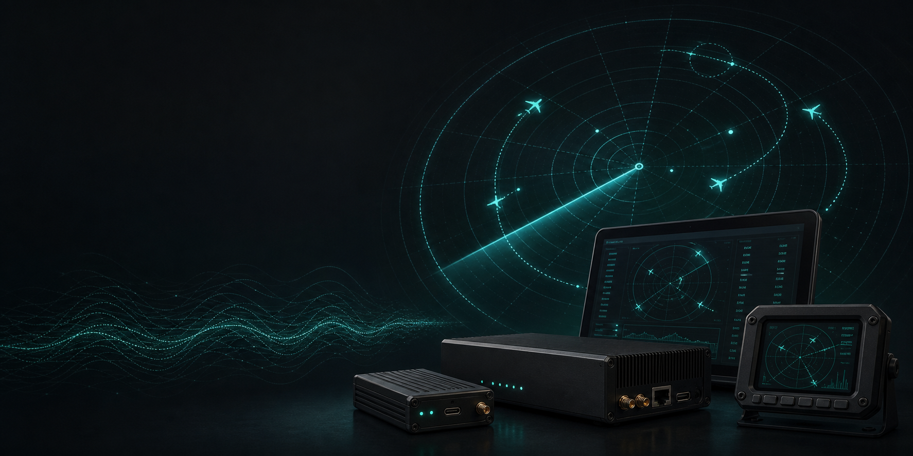
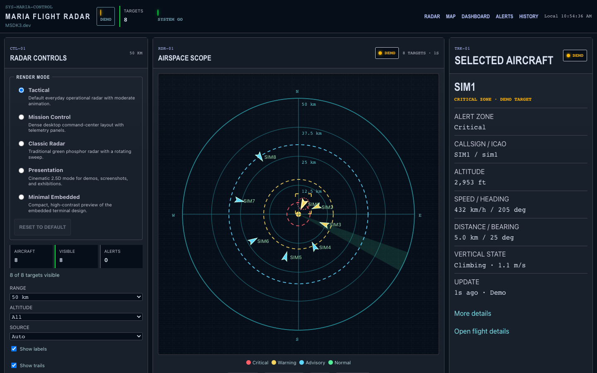
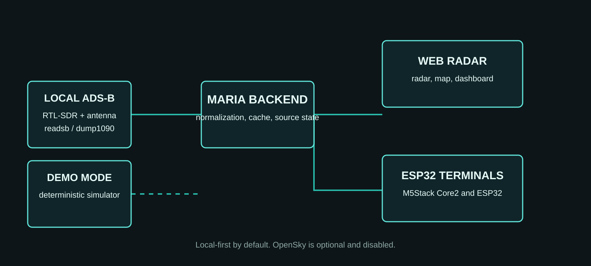

# MARIA Flight Radar

<p align="center">
  
</p>

<p align="center"><strong>Open-source, local-first aircraft visualization for the web and compact ESP32 terminals.</strong></p>

<p align="center">
  <a href="LICENSE">Apache-2.0</a> ·
  <a href="docs/MARIA_V0_1_0_ALPHA_RELEASE_NOTES.md">v0.1.0-alpha</a> ·
  <a href=".github/workflows/public-release-ci.yml">Public CI</a> ·
  Node.js 22.12+ · PlatformIO · Alpha
</p>

> **Early public alpha.** APIs, firmware interfaces, and hardware support may
> change. MARIA includes deterministic demo data for setup and development; it
> does not claim live receiver or physical-board validation without evidence.

> **Safety notice.** MARIA Flight Radar is not certified for navigation, air
> traffic control, collision avoidance, emergency response, or any
> safety-critical aviation function. Data may be delayed, incomplete,
> inaccurate, or unavailable.

## Overview

MARIA Flight Radar connects local readsb or dump1090 data to a modern web radar
and compact ESP32 terminals. It is designed to work without paid services,
cloud data providers, credentials, or an internet connection.

OpenSky is optional, disabled by default, and subject to its current terms,
rate limits, approval, and licensing requirements. MARIA does not send aircraft
or location data to an external provider by default.

## Quick Start: Demo Mode

Demo mode requires no receiver and provides deterministic targets for local
development.

```bash
git clone https://github.com/Msadiq99/maria-flight-radar.git
cd maria-flight-radar
# Use Node.js 22.12 or later.
npm ci
LOCAL_ADSB_SIMULATOR=true OPENSKY_ENABLED=false npm run dev:all
```

Open [the radar console](http://127.0.0.1:5175/radar), then verify the stack:

```bash
npm run dev:check
```

The backend health endpoint is <http://127.0.0.1:8081/health>.



The radar screenshot above is local deterministic demo data, not a live
receiver capture or a physical hardware result.

See the [v0.2 radar mode gallery](docs/assets/screenshots/v0.2/README.md) for
Mission Control, Classic Radar, Presentation, and Minimal Embedded views.

## Architecture

<p align="center">
  
</p>

Demo mode uses the deterministic simulator. Live mode uses an RTL-SDR, a 1090
MHz antenna, readsb or dump1090, and a local `aircraft.json` feed. Configure
receiver coordinates locally only; do not commit them. Live receiver hardware
validation is pending for this alpha.

## Current Release Scope

**Included**

- Web radar, map, and dashboard.
- Local backend, deterministic demo mode, and local ADS-B adapter.
- Live, cache, demo, and offline source states.
- M5Stack Core2 and ESP32-2432S028R firmware source and diagnostics.
- Documentation, contribution templates, Dependabot, and public CI.

**Beta candidate (MARIA v0.2.0-beta.1 — not released)**

- A modular radar rendering engine with five render modes — Tactical
  (default), Mission Control, Classic Radar, Presentation, and Minimal
  Embedded — sharing one scene model and truthful source-state handling.
  See [render modes](docs/MARIA_RADAR_RENDER_MODES.md) and the
  [engine overview](docs/MARIA_V0_2_RADAR_RENDERING_ENGINE.md).

**Not yet included**

- A validated RTL-SDR receiver package or guaranteed reception range.
- Stable firmware binary releases for all boards.
- Production deployment hardening or aviation certification.

## Firmware

See the [firmware support matrix](docs/FIRMWARE_SUPPORT_MATRIX.md) for current
evidence and validation status. M5Stack Core2 firmware is build-validated with
upload evidence; physical display/touch evidence is pending. ESP32-2432S028R is
build-validated; physical validation is pending.

```bash
cd firmware
pio run -e maria-m5stack-core2
pio run -e maria-esp32-2432s028r
```

## Weekly Development

MARIA is under active development, with planned weekly updates across software,
firmware, hardware validation, and future board support.

## Documentation

- [Installation](docs/INSTALLATION.md)
- [Architecture](docs/ARCHITECTURE.md)
- [Firmware support matrix](docs/FIRMWARE_SUPPORT_MATRIX.md)
- [Board porting guide](docs/BOARD_PORTING_GUIDE.md)
- [Release notes](docs/MARIA_V0_1_0_ALPHA_RELEASE_NOTES.md)
- [Roadmap](ROADMAP.md)
- [Contributing](CONTRIBUTING.md)
- [Security reporting](SECURITY.md)
- [Open an issue](https://github.com/Msadiq99/maria-flight-radar/issues)

## License

Licensed under the Apache License 2.0. See [LICENSE](LICENSE).

## Author

Designed and developed by M. Sadiq.
